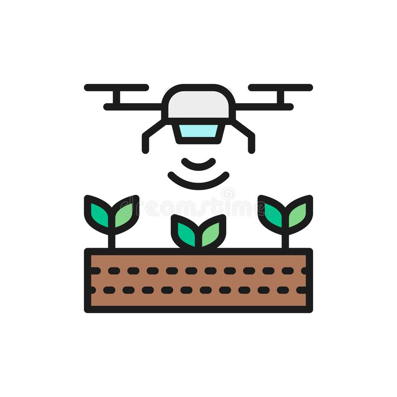

<div id="top"></div>

[![Contributors][contributors-shield]][contributors-url]

[![Issues][issues-shield]][issues-url] 


<!-- PROJECT LOGO -->
<br />
<div align="center">
  <a href="https://github.com/nickvprince/CSCN72030-21F-Sec1_Drone_Group6">
    
  </a>

<h2 align="center">Agricultural Drone</h2>

  <p align="center">
    Agriculture Drone Simulator Based on Drone Sensors. 
    <br />
    <a href="https://github.com/nickvprince/CSCN72030-21F-Sec1_Drone_Group6"><strong>Explore the docs »</strong></a>
    <br />
    <br />
    <a href="https://www.youtube.com/watch?v=dQw4w9WgXcQ">View Demo</a>
    ·
    <a href="https://github.com/nickvprince/CSCN72030-21F-Sec1_Drone_Group6/issues">Report Bug</a>
    ·
    <a href="https://github.com/nickvprince/CSCN72030-21F-Sec1_Drone_Group6/issues">Request Feature</a>
  </p>
</div>

<!-- TABLE OF CONTENTS -->
<details>
  <summary>Table of Contents</summary>
  <ol>
    <li>
      <a href="#about-the-project">About The Project</a>
      <ul>
        <li><a href="#built-with">Built With</a></li>
      </ul>
    </li>
    <li>
      <a href="#getting-started">Getting Started</a>
      <ul>
        <li><a href="#installation">Installation</a></li>
      </ul>
    </li>
    <li><a href="#contact">Contact</a></li>
  </ol>
</details>


<!-- ABOUT THE PROJECT -->
## About The Project

### Built With

<a href="https://visualstudio.microsoft.com/">
    
</a>
<br />
<a href="https://www.cplusplus.com/">
    
</a>

<!-- GETTING STARTED -->
## Getting Started

Follow the steps below to clone and use this project:

### Installation

1. Clone the repo
   ```sh
   git clone https://github.com/nickvprince/CSCN72030-21F-Sec1_Drone_Group6.git
   ```
2. Run the .exe or .sln file to use or debug the project


<!-- CONTACT -->
## Contact

Nicholas Prince | nprince3037@conestogac.on.ca
<br />
Islam Ahmed | iahmed9886@conestogac.on.ca
<br />
Danny Smith | dsmith2304@conestogac.on.ca
<br />
Amanuel Negussie | anegussie9077@conestogac.on.ca

Project Link: [https://github.com/nickvprince/CSCN72030-21F-Sec1_Drone_Group6](https://github.com/nickvprince/CSCN72030-21F-Sec1_Drone_Group6)

<!-- MARKDOWN LINKS & IMAGES -->
<!-- https://www.markdownguide.org/basic-syntax/#reference-style-links -->
[contributors-shield]: https://img.shields.io/github/contributors/github_username/repo_name.svg?style=for-the-badge
[contributors-url]: https://github.com/nickvprince/CSCN72030-21F-Sec1_Drone_Group6/graphs/contributors
[forks-shield]: https://img.shields.io/github/forks/github_username/repo_name.svg?style=for-the-badge
[forks-url]: https://github.com/nickvprince/CSCN72030-21F-Sec1_Drone_Group6/network/members
[stars-shield]: https://img.shields.io/github/stars/github_username/repo_name.svg?style=for-the-badge
[stars-url]: https://github.com/nickvprince/CSCN72030-21F-Sec1_Drone_Group6/stargazers
[issues-shield]: https://img.shields.io/github/issues/github_username/repo_name.svg?style=for-the-badge
[issues-url]: https://github.com/nickvprince/CSCN72030-21F-Sec1_Drone_Group6/issues
[license-shield]: https://img.shields.io/github/license/github_username/repo_name.svg?style=for-the-badge
[license-url]: https://github.com/nickvprince/CSCN72030-21F-Sec1_Drone_Group6/blob/master/LICENSE.txt
[linkedin-shield]: https://img.shields.io/badge/-LinkedIn-black.svg?style=for-the-badge&logo=linkedin&colorB=555
[linkedin-url]: https://linkedin.com/in/linkedin_username
[product-screenshot]: images/screenshot.png
